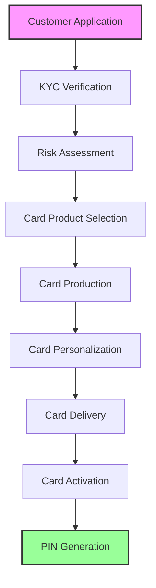
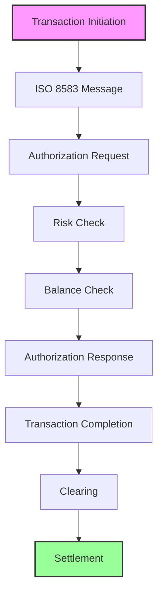
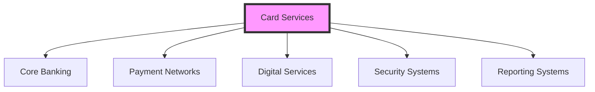

The Card Services module provides comprehensive card management capabilities for financial institutions, supporting various card types and payment networks. This module enables end-to-end card lifecycle management from issuance to transaction processing.

> 💡 **Modern Card Management**
> 
> Woodcore's Card Services module delivers a complete card management solution that supports multiple card types, payment networks, and processing capabilities while ensuring security and compliance. The platform enables rapid deployment of card programs with full ISO 8583 protocol support and comprehensive dispute management.

## Core Capabilities

| Capability | Description | Features |
|------------|-------------|----------|
| **Card Issuance** | End-to-end card issuance process | • Card product management • Card personalization • Card production • Card delivery • Card activation |
| **Transaction Processing** | Comprehensive transaction handling | • Authorization processing • Clearing and settlement • Transaction routing • Fee calculation • Dispute management |
| **Card Management** | Ongoing card lifecycle management | • PIN management • Card blocking/unblocking • Card replacement • Card renewal • Card limits management |
| **Security Management** | Advanced security features | • Fraud detection • Risk scoring • Transaction monitoring • Security alerts • Compliance checks |

## Card Issuance Process Flow

## Transaction Processing Flow

## ISO 8583 Protocol Support

| Protocol Feature | Description | Implementation |
|-----------------|-------------|----------------|
| **Message Types** | Standard message formats | • Authorization (0100/0110) • Financial (0200/0210) • Reversal (0400/0410) • Network Management (0800/0810) |
| **Data Elements** | Message field definitions | • Primary Account Number • Processing Code • Transaction Amount • Transmission Date/Time • Merchant Data |
| **Network Support** | Payment network integration | • Visa • Mastercard • UnionPay • Local Networks • Custom Networks |

> 🔄 **Transaction Processing**
> 
> Woodcore's card processing capabilities include:
> - Full ISO 8583 protocol implementation
> - Real-time authorization processing
> - Multi-currency support
> - Dynamic routing capabilities
> - Comprehensive fee management
> - Automated clearing and settlement
> - Real-time transaction monitoring
> - Advanced fraud detection

## Dispute Management

| Process Stage | Description | Features |
|---------------|-------------|----------|
| **Chargeback Initiation** | Dispute processing start | • Dispute reason codes • Documentation collection • Timeline tracking • Status monitoring • Communication management |
| **Representment** | Merchant response handling | • Evidence collection • Response preparation • Timeline management • Status tracking • Communication handling |
| **Arbitration** | Final dispute resolution | • Case review • Decision management • Settlement processing • Communication handling • Compliance checks |

> ⚠️ **Dispute Resolution**
> 
> The dispute management system provides:
> - Automated chargeback processing
> - Comprehensive reason code support
> - Timeline management
> - Document handling
> - Status tracking
> - Communication management
> - Settlement processing
> - Compliance monitoring

## Key Features

| Feature Category | Description | Components |
|-----------------|-------------|------------|
| **Card Product Management** | Product configuration and setup | • Product configuration • Fee structure setup • Card type management • Network configuration • Product versioning |
| **Card Issuance** | Digital and physical card handling | • Digital card issuance • Physical card production • Card personalization • Card delivery tracking • Card activation |
| **Transaction Processing** | Comprehensive transaction handling | • Real-time authorization • Clearing and settlement • Transaction routing • Fee calculation • Dispute handling |
| **Card Management** | Ongoing card operations | • PIN management • Card blocking/unblocking • Card replacement • Card renewal • Limits management |

## Integration Points

> ℹ️ **System Integration**
> 
> The Card Services module integrates with:
> - Core Banking System for account management
> - Payment Networks for transaction processing
> - Digital Services for mobile/online access
> - Security Systems for fraud prevention
> - Reporting Systems for analytics
> - ISO 8583 Gateways for network communication
> - Dispute Management Systems
> - Compliance Monitoring Systems

## Security and Compliance

| Aspect | Features | Capabilities |
|--------|----------|--------------|
| **Security Features** | Card security measures | • EMV compliance • PCI DSS compliance • Tokenization • Encryption • Fraud prevention |
| **Compliance Features** | Regulatory compliance | • Regulatory reporting • Transaction monitoring • Audit logging • Compliance checks • Risk management |

> ⚠️ **Important Note**
> 
> Before processing live card transactions, ensure:
> - PCI DSS compliance certification
> - EMV compliance implementation
> - Network certification completion
> - Security measures configuration
> - Compliance monitoring setup
> - Dispute management procedures
> - Settlement processes
> - Risk management controls
