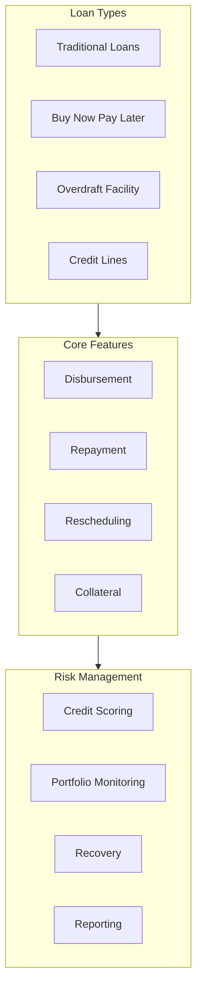
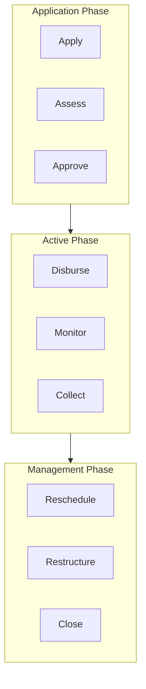
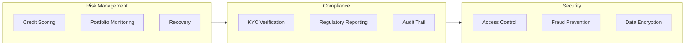

<Note>
The Loan Management module is a powerful system that enables financial institutions and fintechs to offer various credit products, from traditional loans to modern BNPL and overdraft facilities. It provides a flexible framework for managing the entire loan lifecycle with robust risk management capabilities.
</Note>

## Loan Types & Features



<AccordionGroup>
  <Accordion title="Modern Credit Solutions" defaultOpen={true}>
    <Info>
    Modern credit solutions like BNPL and overdraft facilities are becoming increasingly popular in fintech applications, offering flexible credit options to customers.
    </Info>

    ### Buy Now Pay Later (BNPL)
    ```mermaid
    flowchart LR
        subgraph BNPLFlow[BNPL Flow]
            Purchase[Purchase Initiated]
            Approval[Instant Approval]
            Disbursement[Merchant Payment]
            Repayment[Installment Repayment]
        end

        subgraph BNPLFeatures[BNPL Features]
            SplitPay[Split Payments]
            NoInterest[No Interest]
            LateFees[Late Fees]
            CreditLimit[Credit Limit]
        end

        BNPLFlow --> BNPLFeatures
    ```

    <Tip>
    BNPL solutions typically offer interest-free periods with late fees, making them attractive for short-term financing needs.
    </Tip>

    - Split payments into installments
    - Interest-free periods
    - Late fee management
    - Credit limit controls
    - Merchant integration
    - Automated repayments
    - Risk assessment
    - Collection management

    ### Overdraft Facility
    ```mermaid
    flowchart LR
        subgraph OverdraftFlow[Overdraft Flow]
            Account[Account Balance]
            Limit[Overdraft Limit]
            Usage[Overdraft Usage]
            Interest[Interest Calculation]
        end

        subgraph OverdraftFeatures[Overdraft Features]
            AutoApproval[Auto Approval]
            InterestCalc[Interest Calculation]
            Repayment[Repayment]
            LimitMgmt[Limit Management]
        end

        OverdraftFlow --> OverdraftFeatures
    ```

    <Warning>
    Overdraft facilities should be carefully managed with appropriate limits and interest rates to prevent excessive usage.
    </Warning>

    - Automatic approval
    - Interest calculation
    - Limit management
    - Repayment scheduling
    - Usage monitoring
    - Risk assessment
    - Collection management
  </Accordion>

  <Accordion title="Traditional Loans">
    <Info>
    Traditional loans provide structured financing options for various purposes with defined terms and conditions.
    </Info>

    ### Personal Loans
    - Unsecured financing
    - Fixed interest rates
    - EMI-based repayment
    - Flexible tenures
    - Quick disbursement
    - Credit scoring
    - Documentation management

    ### Business Loans
    - Working capital
    - Term loans
    - Equipment financing
    - Invoice financing
    - Business credit lines
    - Collateral management
    - Financial analysis

    ### Mortgage Loans
    - Property financing
    - Long-term loans
    - Collateral management
    - Interest rate options
    - Repayment schedules
    - Insurance integration
    - Property valuation
  </Accordion>
</AccordionGroup>

## Loan Lifecycle Management



<AccordionGroup>
  <Accordion title="Loan Operations" defaultOpen={true}>
    ### Disbursement
    <Info>
    Loan disbursement can be automated for certain loan types like BNPL and overdrafts, while traditional loans may require manual approval.
    </Info>

    - Automated disbursement
    - Manual approval workflow
    - Multi-account disbursement
    - Payment tracking
    - Disbursement scheduling
    - Fee calculation
    - Documentation verification

    ### Repayment Management
    <Tip>
    Effective repayment management is crucial for maintaining portfolio health and ensuring timely collections.
    </Tip>

    - EMI calculation
    - Payment scheduling
    - Auto-debit setup
    - Payment tracking
    - Late payment handling
    - Prepayment processing
    - Interest adjustment

    ### Rescheduling & Restructuring
    <Warning>
    Loan rescheduling should be carefully evaluated to ensure it doesn't increase portfolio risk.
    </Warning>

    - Term extension
    - EMI adjustment
    - Interest rate modification
    - Payment holiday
    - Principal reduction
    - Collateral adjustment
    - Documentation update
  </Accordion>
</AccordionGroup>

## Risk & Compliance



<AccordionGroup>
  <Accordion title="Risk Management" defaultOpen={true}>
    ### Credit Assessment
    - Credit scoring
    - Income verification
    - Employment check
    - Credit history
    - Risk rating
    - Limit calculation
    - Portfolio analysis

    ### Portfolio Monitoring
    - Performance tracking
    - Risk indicators
    - Early warning
    - Collection efficiency
    - Portfolio health
    - Risk concentration
    - Market analysis

    ### Recovery Management
    - Collection strategies
    - Payment reminders
    - Legal action
    - Settlement options
    - Recovery tracking
    - Agent management
    - Performance reporting
  </Accordion>
</AccordionGroup>

## Integration & APIs

<Info>
The Loan Management module provides comprehensive APIs for fintechs to integrate credit services into their applications.
</Info>

- RESTful APIs
- WebSocket support
- Batch processing
- Real-time updates
- Event notifications
- Webhook integration
- SDK support

## Next Steps

Explore related modules to learn more about:
- [Account Management](/modules/core-banking/accounts)
- [Transaction Processing](/modules/core-banking/transactions)
- [Risk Management](/modules/core-banking/risk)
- [Payment Systems](/modules/core-banking/payments)
