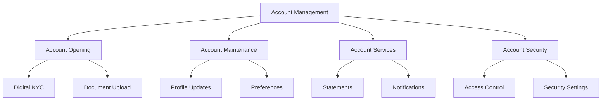

The Digital Account Management component provides comprehensive capabilities for managing customer accounts through digital channels.

## Account Types

<Accordion title="Personal Accounts">
- Savings Accounts
- Current Accounts
- Fixed Deposit Accounts
- Investment Accounts
- Digital Wallets
</Accordion>

<Accordion title="Business Accounts">
- Business Current Accounts
- Business Savings Accounts
- Corporate Accounts
- Merchant Accounts
- Escrow Accounts
</Accordion>

## Account Features

## Key Capabilities

| Capability | Description | Features |
|------------|-------------|----------|
| **Account Opening** | Initial account setup and verification | • Digital KYC verification • Document management • Account type selection • Initial deposit processing • Account activation |
| **Account Maintenance** | Ongoing account management | • Profile updates • Account preferences • Service subscriptions • Document updates • Account status management |
| **Account Services** | Customer service and support features | • Statement generation • Transaction history • Account alerts • Service requests • Account closure |

> ℹ️ **Digital Account Features**
> 
> All account management features are available through multiple digital channels including mobile apps, internet banking, and API access. This ensures customers can manage their accounts conveniently through their preferred platform.

## Security Features

<Accordion title="Access Control">
- Multi-factor authentication
- Role-based access
- Session management
- Device management
- IP restrictions
</Accordion>

<Accordion title="Transaction Security">
- Transaction limits
- Approval workflows
- Fraud monitoring
- Alert notifications
- Activity logging
</Accordion>

> ⚠️ **Important Security Note**
> 
> Ensure proper KYC verification and security measures are in place before enabling account access through digital channels. This includes thorough identity verification, risk assessment, and compliance checks.
