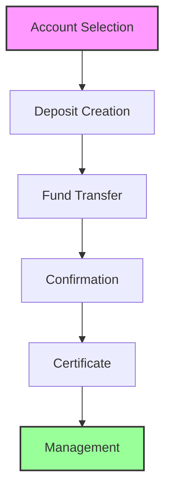

The Digital Deposit Services component provides comprehensive capabilities for managing deposit products and services through digital channels. This modern banking solution enables customers to manage their savings and investments efficiently through various digital platforms, offering convenience and flexibility in managing their financial assets.

## Deposit Types

<Accordion title="Time Deposits">
- Fixed Deposits: Long-term investment options with guaranteed returns
- Term Deposits: Flexible duration deposits with competitive interest rates
- Certificate of Deposits: Secure investment instruments with fixed terms
- Structured Deposits: Customized investment products with market-linked returns
- Call Deposits: Flexible deposits with instant access to funds
</Accordion>

<Accordion title="Demand Deposits">
- Savings Accounts: Interest-bearing accounts for personal savings
- Current Accounts: Transaction accounts for daily banking needs
- Money Market Accounts: High-yield accounts with check-writing privileges
- Digital Wallets: Electronic payment and storage solutions
- Escrow Accounts: Secure holding accounts for third-party transactions
</Accordion>

## Deposit Process

## Key Capabilities

| Capability | Description | Features |
|------------|-------------|----------|
| **Deposit Creation** | Initial deposit setup and processing | • Comprehensive product selection with detailed comparisons • Flexible term selection with rate optimization • Advanced rate calculation with market analysis • Secure fund transfer system • Digital certificate generation and storage |
| **Deposit Management** | Ongoing deposit account management | • Real-time balance tracking and monitoring • Automated interest calculation and crediting • Proactive maturity management • Streamlined renewal processing • Simplified early withdrawal procedures |
| **Deposit Services** | Customer service and support features | • Automated statement generation and delivery • Scheduled interest payment processing • Secure deposit transfer capabilities • Comprehensive lien management • Efficient closure processing |

> ℹ️ **Digital Deposit Features**
> 
> Our digital deposit services are accessible through multiple channels including mobile applications, internet banking, and API interfaces. The system provides automated processing capabilities, ensuring efficient management of deposit accounts and timely service delivery.

## Security Features

<Accordion title="Transaction Security">
- Multi-layer fund transfer security
- Dynamic transaction limits
- Multi-level approval workflows
- Advanced fraud prevention
- Real-time security alerts
</Accordion>

<Accordion title="Account Security">
- Role-based access control
- Multi-factor authentication
- Comprehensive activity monitoring
- Secure document management
- Detailed audit logging
</Accordion>

> ⚠️ **Important Security Note**
> 
> Before processing any deposit transactions, it is essential to ensure that all necessary security measures and compliance requirements are properly implemented. This includes thorough verification processes, transaction monitoring, and regulatory compliance checks.

> 💡 **Integration Note**
> 
> The Digital Deposit Services module integrates with multiple systems to provide a seamless experience:
> - Core Banking System for seamless transaction processing
> - Document Management System for secure file handling
> - Authentication Systems for user verification
> - Notification Systems for real-time updates
> - Reporting Systems for comprehensive analytics
