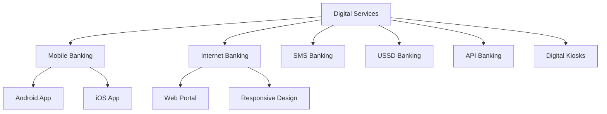
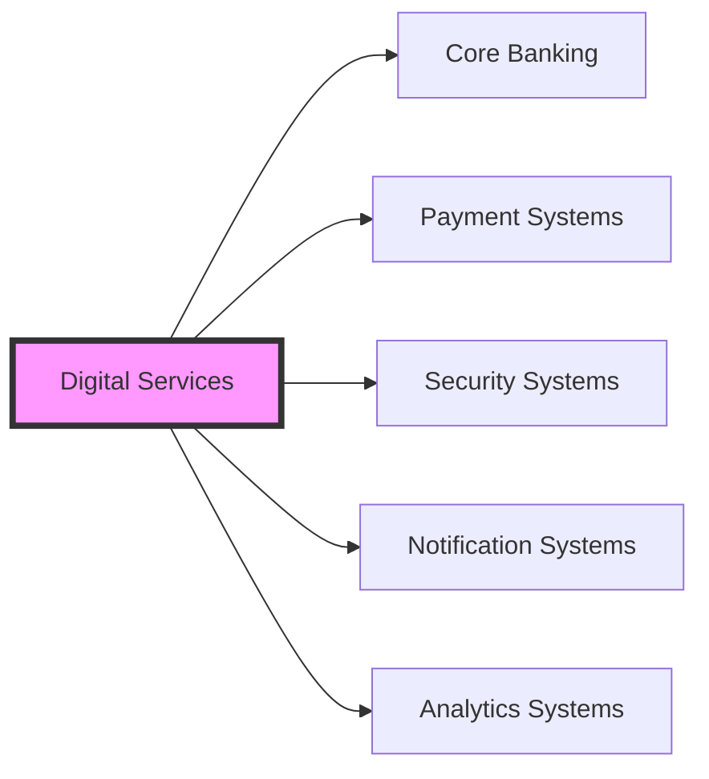

The Digital Services module is the cornerstone of Woodcore's digital banking transformation, providing a comprehensive suite of digital banking capabilities that enable financial institutions to deliver seamless banking experiences across multiple channels.

:::tip Digital Banking Evolution
Woodcore's Digital Services module is designed to help financial institutions transition from traditional banking to modern digital banking, ensuring they stay competitive in today's rapidly evolving financial landscape.
:::

## Key Features

<Accordion title="Features">
<AccordionItem title="Digital Account Management">
- Self-service account opening
- Account maintenance and updates
- Digital KYC and onboarding
- Account preferences management
- Document management
</AccordionItem>

<AccordionItem title="Digital Transaction Processing">
- Real-time transaction processing
- Multi-currency support
- Transaction scheduling
- Standing instructions
- Transaction limits management
</AccordionItem>

<AccordionItem title="Digital Loan Services">
- Digital loan applications
- Loan status tracking
- Digital loan disbursement
- Loan repayment management
- Loan statement generation
</AccordionItem>

<AccordionItem title="Digital Payment Solutions">
- P2P transfers
- Bill payments
- Merchant payments
- International remittances
- Payment scheduling
</AccordionItem>
</Accordion>

## Digital Channels

## Security Architecture

<Accordion>
<AccordionItem title="Authentication">
- Multi-factor Authentication (MFA)
- Biometric Authentication
- OTP-based verification
- Device fingerprinting
- Risk-based authentication
</AccordionItem>

<AccordionItem title="Data Protection">
- End-to-end encryption
- Secure key management
- Data masking
- Secure session handling
- Audit logging
</AccordionItem>

<AccordionItem title="Fraud Prevention">
- Real-time fraud monitoring
- Transaction screening
- Behavioral analytics
- Risk scoring
- Alert management
</AccordionItem>
</Accordion>

## System Integration

:::note Integration Capabilities
The Digital Services module is designed with a microservices architecture, allowing seamless integration with existing systems while maintaining high performance and scalability.
:::

## Getting Started

1. **System Requirements**
   - Core Banking System Integration
   - Security Infrastructure
   - Network Infrastructure
   - Database Systems

2. **Implementation Steps**
   - System Assessment
   - Integration Planning
   - Security Configuration
   - Channel Setup
   - Testing and Validation

3. **Deployment Options**
   - Cloud Deployment
   - On-premise Deployment
   - Hybrid Deployment

:::warning Important Note
Ensure all security measures are properly configured before going live with any digital channel.
:::
