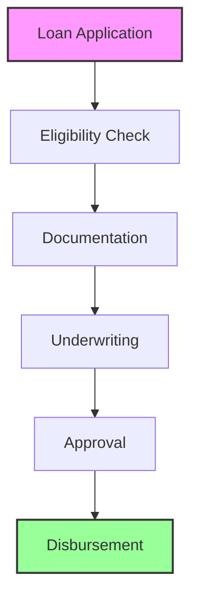

The Digital Loan Services component provides comprehensive capabilities for managing loan products and services through digital channels. This modern banking solution enables customers to access various loan products, manage their applications, and handle loan-related transactions entirely through digital platforms.

## Loan Types

<Accordion title="Personal Loans">
- Personal Loans: Flexible financing options for individual needs
- Education Loans: Specialized funding for academic pursuits
- Vehicle Loans: Financing solutions for automobile purchases
- Home Improvement Loans: Funding for property renovations and upgrades
- Emergency Loans: Quick access to funds for urgent situations
</Accordion>

<Accordion title="Business Loans">
- Business Loans: Comprehensive financing for business operations
- Working Capital Loans: Short-term funding for daily operations
- Equipment Financing: Specialized loans for business equipment
- Trade Finance: Solutions for international trade activities
- Project Finance: Long-term funding for major business projects
</Accordion>

## Loan Process

## Key Capabilities

| Capability | Description | Features |
|------------|-------------|----------|
| **Loan Application** | Digital loan application and processing | • Digital application forms with intuitive user interface • Advanced eligibility calculator with real-time assessment • Secure document upload system with multiple format support • Comprehensive application tracking with status updates • Automated status notifications and follow-ups |
| **Loan Processing** | Automated loan processing and decision making | • Automated underwriting with AI-powered decision making • Comprehensive credit assessment and scoring • Advanced risk scoring algorithms • Multi-level approval workflows • Streamlined disbursement processing |
| **Loan Management** | Ongoing loan servicing and management | • Flexible repayment scheduling options • Automated payment processing system • Detailed statement generation and delivery • Dynamic loan restructuring capabilities • Simplified early settlement processing |

> ℹ️ **Digital Loan Features**
> 
> Our digital loan services are accessible through multiple channels including mobile applications, internet banking, and API interfaces. The system provides automated processing capabilities, ensuring quick turnaround times and efficient service delivery.

## Security Features

<Accordion title="Application Security">
- Advanced document verification system
- Multi-factor identity verification
- Comprehensive credit checks
- Sophisticated risk assessment
- Real-time fraud prevention
</Accordion>

<Accordion title="Transaction Security">
- Multi-layer payment authentication
- Real-time transaction monitoring
- Secure disbursement protocols
- Automated repayment tracking
- Proactive security alerts
</Accordion>

> ⚠️ **Important Security Note**
> 
> Before processing any loan applications, it is crucial to ensure that all necessary security measures and compliance requirements are properly implemented. This includes thorough verification processes, risk assessment protocols, and regulatory compliance checks.

> 💡 **Integration Note**
> 
> The Digital Loan Services module integrates with multiple systems to provide a seamless experience:
> - Core Banking System for seamless transaction processing
> - Document Management System for secure file handling
> - Authentication Systems for user verification
> - Notification Systems for real-time updates
> - Reporting Systems for comprehensive analytics
