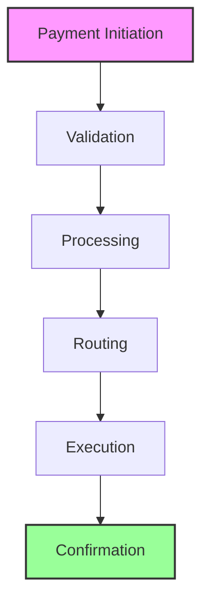

The Digital Payment Services component provides comprehensive capabilities for processing and managing various types of payments through digital channels. This modern banking solution enables customers to conduct secure and efficient financial transactions across multiple platforms, offering convenience and flexibility in managing their payment needs.

## Payment Types

<Accordion title="Domestic Payments">
- P2P Transfers: Instant person-to-person money transfers
- Bill Payments: Automated utility and service bill payments
- Merchant Payments: Secure business-to-consumer transactions
- Utility Payments: Scheduled payments for essential services
- Government Payments: Official payment processing for government services
</Accordion>

<Accordion title="International Payments">
- International Remittances: Cross-border money transfers
- Foreign Exchange: Currency conversion and transfer services
- Cross-border Payments: Global business transaction processing
- Trade Payments: International trade settlement services
- SWIFT Transfers: Secure international wire transfers
</Accordion>

<Accordion title="Blockchain Payments">
- Cryptocurrency Transfers: Secure digital currency transactions
- Smart Contract Payments: Automated contract-based payments
- Tokenized Assets: Digital asset transfer and management
- Cross-chain Transactions: Interoperable blockchain transfers
- DeFi Payments: Decentralized finance transactions
</Accordion>

## Payment Process

## Key Capabilities

| Capability | Description | Features |
|------------|-------------|----------|
| **Payment Processing** | Core payment handling and execution | • Real-time payment processing with instant confirmation • Efficient batch processing for multiple transactions • Flexible scheduled payment management • Automated recurring payment handling • Intelligent payment routing optimization |
| **Payment Management** | Comprehensive payment oversight | • Comprehensive payment tracking system • Real-time status monitoring • Dynamic payment limits management • Multi-level approval workflows • Detailed payment history and analytics |
| **Payment Services** | Advanced payment features and support | • Multi-currency support with real-time rates • Competitive exchange rate calculations • Transparent fee structure and calculation • Automated settlement processing • Comprehensive reconciliation services |

> ℹ️ **Digital Payment Features**
> 
> Our digital payment services are accessible through multiple channels including mobile applications, internet banking, and API interfaces. The system provides real-time processing capabilities, ensuring quick and efficient payment execution across all supported channels.

## Woodcore Integration

| Integration Type | Description | Benefits |
|-----------------|-------------|----------|
| **Traditional Banking** | Integration with core banking systems | • Seamless transaction processing • Real-time account updates • Automated reconciliation • Comprehensive reporting • Regulatory compliance |
| **Blockchain Payments** | Support for cryptocurrency and smart contracts | • Multi-cryptocurrency support • Smart contract integration • Cross-chain compatibility • DeFi protocol support • Secure wallet management |
| **Payment Gateways** | Integration with payment processors | • Multiple payment methods • Global payment networks • Real-time processing • Fraud prevention • Settlement automation |

> 💡 **Woodcore Blockchain Capabilities**
> 
> Woodcore provides comprehensive blockchain payment solutions:
> - Support for multiple cryptocurrencies and tokens
> - Integration with major blockchain networks
> - Smart contract execution and management
> - Cross-chain transaction capabilities
> - DeFi protocol integration
> - Secure digital asset management
> - Real-time blockchain transaction monitoring
> - Automated compliance and reporting

## Security Features

<Accordion title="Transaction Security">
- Multi-factor payment authentication
- Advanced fraud detection systems
- Real-time risk scoring
- Dynamic transaction limits
- Proactive security alerts
</Accordion>

<Accordion title="Compliance Features">
- Comprehensive payment monitoring
- Automated regulatory reporting
- Detailed audit logging
- Real-time compliance checks
- Advanced risk management
</Accordion>

> ⚠️ **Important Security Note**
> 
> Before processing any live payments, it is crucial to ensure that all necessary security measures and compliance requirements are properly implemented. This includes thorough verification processes, transaction monitoring, and regulatory compliance checks.

## Payment Management

| Function | Description | Features |
|----------|-------------|----------|
| **Payment Initiation** | Secure payment creation | • Multi-factor authentication • Real-time validation • Risk assessment • Compliance checks • Transaction limits |
| **Payment Processing** | Efficient transaction handling | • Real-time processing • Automated routing • Status tracking • Error handling • Confirmation delivery |
| **Payment Monitoring** | Comprehensive oversight | • Real-time tracking • Status updates • Alert management • Performance metrics • Compliance monitoring |

> 🔄 **Integration Note**
> 
> The Digital Payment Services module integrates with multiple systems to provide a seamless experience:
> - Core Banking System for seamless transaction processing
> - Payment Gateways for secure transaction routing
> - Authentication Systems for user verification
> - Notification Systems for real-time updates
> - Reporting Systems for comprehensive analytics
> - Blockchain Networks for cryptocurrency support
> - Smart Contract Platforms for automated payments
> - DeFi Protocols for decentralized finance
