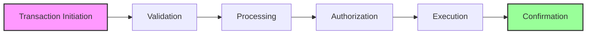

The Digital Transaction Management component provides comprehensive capabilities for processing and managing financial transactions through digital channels.

## Transaction Types

<Accordion title="Account Transactions">
- Fund Transfers
- Bill Payments
- Standing Instructions
- Recurring Payments
- Scheduled Payments
</Accordion>

<Accordion title="Payment Transactions">
- P2P Transfers
- Merchant Payments
- International Remittances
- QR Code Payments
- Contactless Payments
</Accordion>

## Transaction Flow

## Key Capabilities

| Capability | Description | Features |
|------------|-------------|----------|
| **Transaction Processing** | Core transaction handling capabilities | • Real-time processing • Batch processing • Scheduled transactions • Recurring transactions • Transaction routing |
| **Transaction Management** | Comprehensive transaction oversight | • Transaction monitoring • Status tracking • Transaction limits • Approval workflows • Transaction history |
| **Payment Processing** | Advanced payment handling features | • Multiple payment methods • Currency conversion • Fee calculation • Payment routing • Settlement processing |

## Transaction Features
All transaction features are available through multiple digital channels with real-time processing capabilities.

## Security Features

<Accordion title="Transaction Security">
- Transaction authentication
- Fraud detection
- Risk scoring
- Transaction limits
- Security alerts
</Accordion>

<Accordion title="Compliance Features">
- Transaction monitoring
- Regulatory reporting
- Audit logging
- Compliance checks
- Risk management
</Accordion>

> ⚠️ **Important Security Note**
> 
> Ensure proper transaction security measures and compliance requirements are in place before processing live transactions. This includes thorough verification processes, transaction monitoring, and regulatory compliance checks.

