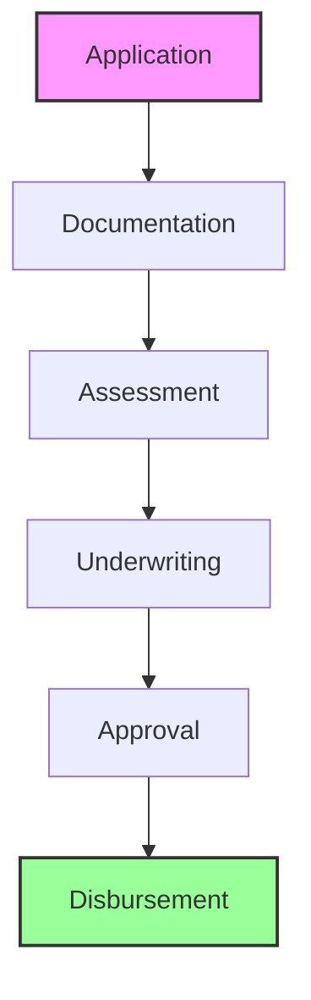

# Loan Creation Management

The Loan Creation Management component provides comprehensive capabilities for creating and processing loan applications.

## Creation Process

<Accordion>
<AccordionItem title="Application Process">
- Application intake
- Document collection
- Eligibility check
- Credit assessment
- Application review
</AccordionItem>

<AccordionItem title="Approval Process">
- Underwriting
- Risk assessment
- Approval workflow
- Terms setting
- Disbursement setup
</AccordionItem>
</Accordion>

## Loan Creation Flow

## Key Capabilities

1. **Application Management**
   - Digital applications
   - Document management
   - Application tracking
   - Status updates
   - Communication

2. **Assessment Process**
   - Eligibility check
   - Credit assessment
   - Risk scoring
   - Capacity analysis
   - Collateral evaluation

3. **Approval Process**
   - Underwriting
   - Terms setting
   - Approval workflow
   - Disbursement setup
   - Loan activation

:::note Creation Features
Comprehensive loan creation features with automated processing and workflow capabilities.
:::

## Security Features

<Accordion>
<AccordionItem title="Application Security">
- Document verification
- Identity verification
- Credit checks
- Risk assessment
- Fraud prevention
</AccordionItem>

<AccordionItem title="Process Security">
- Workflow security
- Access control
- Audit logging
- Compliance checks
- Security monitoring
</AccordionItem>
</Accordion>

:::warning Important Note
Ensure proper loan creation security measures and compliance requirements are in place before processing applications.
:::
