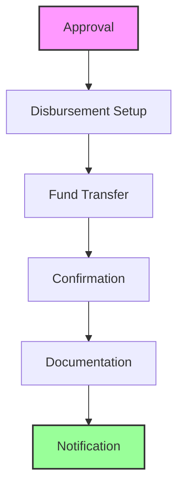

# Loan Disbursement Management

The Loan Disbursement Management component provides comprehensive capabilities for managing loan disbursements and fund transfers.

## Features

- Disbursement Processing
- Payment Scheduling
- Fund Transfer
- Disbursement Tracking
- Disbursement History
- Disbursement Reports

## Disbursement Types

<Accordion>
<AccordionItem title="Disbursement Methods">
- Direct Credit
- Check Disbursement
- Cash Disbursement
- Electronic Transfer
- Mobile Money
</AccordionItem>

<AccordionItem title="Disbursement Channels">
- Bank Transfer
- Mobile Banking
- Internet Banking
- Branch Disbursement
- ATM Disbursement
</AccordionItem>
</Accordion>

## Disbursement Process

## Key Capabilities

1. **Disbursement Setup**
   - Method selection
   - Channel setup
   - Amount verification
   - Terms confirmation
   - Schedule setup

2. **Fund Transfer**
   - Account verification
   - Transfer processing
   - Transaction routing
   - Settlement handling
   - Confirmation

3. **Disbursement Management**
   - Status tracking
   - Document generation
   - Notification sending
   - Record keeping
   - Reconciliation

:::note Disbursement Features
Comprehensive disbursement features with multiple channels and automated processing capabilities.
:::

## Security Features

<Accordion>
<AccordionItem title="Transfer Security">
- Transaction authentication
- Fraud prevention
- Risk assessment
- Transfer limits
- Security alerts
</AccordionItem>

<AccordionItem title="Process Security">
- Workflow security
- Access control
- Audit logging
- Compliance checks
- Security monitoring
</AccordionItem>
</Accordion>

:::warning Important Note
Ensure proper disbursement security measures and compliance requirements are in place before processing fund transfers.
:::

## Integration

The Disbursements module integrates with:
- Payment Systems
- Account Management
- Transaction Processing
- Document Management
- Notification Systems
- Reporting Systems
