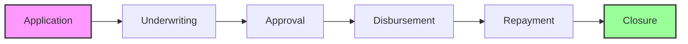
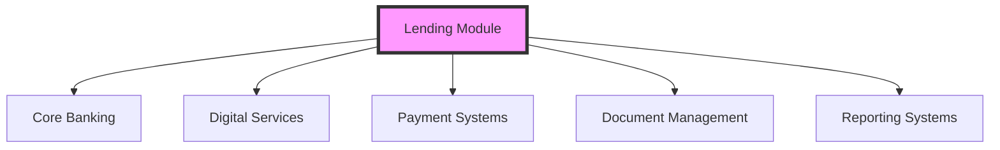

# Lending Module

The Lending module is Woodcore's comprehensive loan management solution, designed to streamline the entire lending lifecycle from application to repayment. This module empowers financial institutions to efficiently manage their loan portfolios while ensuring compliance and risk management.

:::tip Modern Lending Solution
Woodcore's Lending module transforms traditional lending processes into a digital-first approach, enabling faster loan processing, better risk management, and improved customer experience.
:::

## Core Capabilities

<Accordion>
<AccordionItem title="Loan Portfolio Management">
- Portfolio monitoring and analytics
- Risk assessment and scoring
- Portfolio performance tracking
- Portfolio diversification
- Portfolio reporting
</AccordionItem>

<AccordionItem title="Loan Product Management">
- Product configuration
- Interest rate management
- Fee structure setup
- Loan term management
- Product versioning
</AccordionItem>

<AccordionItem title="Loan Processing">
- Digital loan applications
- Automated underwriting
- Document management
- Approval workflows
- Disbursement processing
</AccordionItem>

<AccordionItem title="Repayment Management">
- Payment scheduling
- Collection management
- Early repayment handling
- Late payment processing
- Restructuring options
</AccordionItem>
</Accordion>

## Lending Lifecycle

## Key Features

1. **Loan Creation**
   - Digital application forms
   - Automated eligibility checks
   - Document verification
   - Credit scoring integration
   - Collateral management

2. **Disbursement Processing**
   - Multi-channel disbursement
   - Payment scheduling
   - Disbursement tracking
   - Document generation
   - Notification management

3. **Repayment Management**
   - Flexible repayment schedules
   - Multiple payment channels
   - Early repayment options
   - Late payment handling
   - Restructuring capabilities

4. **Portfolio Management**
   - Portfolio analytics
   - Risk monitoring
   - Performance tracking
   - Regulatory reporting
   - Portfolio optimization

## Integration Points

:::note System Integration
The Lending module seamlessly integrates with other Woodcore modules to provide a complete lending solution, from customer onboarding to loan closure.
:::

## Security and Compliance

<Accordion>
<AccordionItem title="Security Features">
- Role-based access control
- Audit logging
- Data encryption
- Secure document storage
- Transaction security
</AccordionItem>

<AccordionItem title="Compliance Features">
- Regulatory reporting
- Compliance monitoring
- Policy enforcement
- Documentation management
- Audit trails
</AccordionItem>
</Accordion>

:::warning Important Note
Ensure all lending policies and procedures are properly configured and tested before processing live loans.
:::
