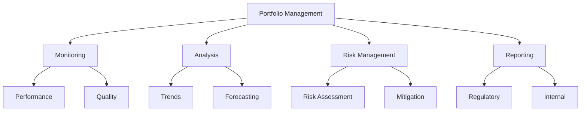

# Loan Portfolio Management

The Loan Portfolio Management component provides comprehensive capabilities for managing and monitoring loan portfolios.

## Portfolio Types

<Accordion>
<AccordionItem title="Portfolio Categories">
- Retail Portfolio
- Corporate Portfolio
- SME Portfolio
- Microfinance Portfolio
- Specialized Portfolio
</AccordionItem>

<AccordionItem title="Portfolio Segments">
- Personal Loans
- Business Loans
- Mortgage Loans
- Auto Loans
- Education Loans
</AccordionItem>
</Accordion>

## Portfolio Management

## Key Capabilities

1. **Portfolio Monitoring**
   - Performance tracking
   - Quality assessment
   - Risk monitoring
   - Portfolio health
   - Early warning

2. **Portfolio Analysis**
   - Trend analysis
   - Performance metrics
   - Risk analytics
   - Portfolio forecasting
   - Strategy planning

3. **Risk Management**
   - Risk assessment
   - Risk scoring
   - Risk mitigation
   - Portfolio optimization
   - Compliance monitoring

:::note Portfolio Features
Comprehensive portfolio management features with advanced analytics and reporting capabilities.
:::

## Security Features

<Accordion>
<AccordionItem title="Data Security">
- Access control
- Data encryption
- Audit logging
- Security monitoring
- Compliance checks
</AccordionItem>

<AccordionItem title="Risk Security">
- Risk assessment
- Fraud prevention
- Portfolio security
- Alert management
- Risk reporting
</AccordionItem>
</Accordion>

:::warning Important Note
Ensure proper portfolio security measures and compliance requirements are in place before accessing portfolio data.
:::

## Features

- Portfolio Overview
- Portfolio Analysis
- Risk Assessment
- Performance Monitoring
- Portfolio Reporting
- Portfolio Analytics

## Portfolio Operations

- Portfolio Creation
- Portfolio Monitoring
- Risk Management
- Performance Tracking
- Portfolio Adjustment
- Portfolio Reporting

## Risk Management

- Credit Risk Assessment
- Portfolio Risk Analysis
- Risk Mitigation
- Risk Reporting
- Risk Monitoring
- Risk Alerts

## Integration

The Portfolio Management module integrates with:
- Loan Management
- Risk Management
- Reporting Systems
- Analytics Systems
- Compliance Systems
