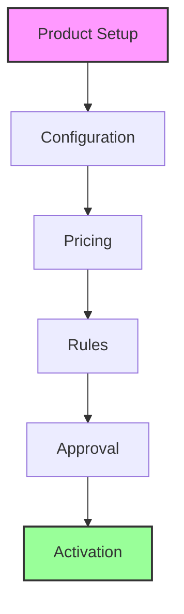

# Loan Product Management

The Loan Product Management component provides comprehensive capabilities for managing and configuring loan products.

## Product Types

<Accordion>
<AccordionItem title="Retail Products">
- Personal Loans
- Auto Loans
- Education Loans
- Home Loans
- Consumer Loans
</AccordionItem>

<AccordionItem title="Business Products">
- Business Loans
- Working Capital
- Equipment Finance
- Trade Finance
- Project Finance
</AccordionItem>
</Accordion>

## Product Configuration

## Key Capabilities

1. **Product Setup**
   - Product definition
   - Feature configuration
   - Parameter setup
   - Rule configuration
   - Product versioning

2. **Pricing Management**
   - Interest rates
   - Fee structure
   - Pricing rules
   - Rate cards
   - Special offers

3. **Product Rules**
   - Eligibility rules
   - Approval rules
   - Disbursement rules
   - Repayment rules
   - Risk rules

:::note Product Features
Comprehensive product management features with flexible configuration and pricing capabilities.
:::

## Security Features

<Accordion>
<AccordionItem title="Configuration Security">
- Access control
- Change management
- Audit logging
- Version control
- Approval workflows
</AccordionItem>

<AccordionItem title="Product Security">
- Data security
- Rule validation
- Compliance checks
- Risk assessment
- Security monitoring
</AccordionItem>
</Accordion>

:::warning Important Note
Ensure proper product configuration and security measures are in place before activating loan products.
:::
