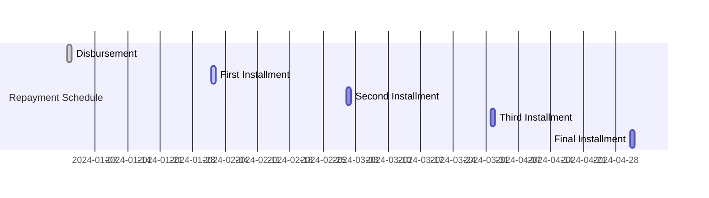

# Loan Repayment Management

The Loan Repayment Management component enables financial institutions and customers to manage, track, and process loan repayments efficiently. It supports multiple repayment methods, schedules, and provides transparency for both lenders and borrowers.

## Repayment Methods Comparison

| Method              | Description                          | Suitable For         | Notes                       |
|---------------------|--------------------------------------|----------------------|-----------------------------|
| Auto-Debit          | Scheduled automatic deduction        | Salaried customers   | Reduces missed payments     |
| Manual Payment      | Customer-initiated payment           | All borrowers        | Flexible, but less reliable |
| Payroll Deduction   | Deducted from salary at source       | Employees            | Requires employer setup     |
| Mobile/Online       | Via mobile app or online banking     | Tech-savvy users     | Real-time confirmation      |
| Branch Payment      | In-person at bank branch             | All borrowers        | Useful for cash payments    |

## Repayment Schedule Example

Repayments can be structured in various ways:
- **Equal Monthly Installments (EMI)**
- **Bullet Repayment** (lump sum at end)
- **Flexible/Custom Schedules**

## Repayment Process
1. **Notification**: Borrower receives reminder before due date.
2. **Payment**: Borrower pays via chosen method (see table above).
3. **Confirmation**: System updates repayment status and sends receipt.
4. **Reconciliation**: Payments are matched with loan schedules.
5. **Reporting**: Borrower and institution can view repayment history.

:::tip Best Practice
Encourage borrowers to set up auto-debit or payroll deduction to minimize missed payments and reduce operational overhead.
:::

## Key Features
- Multiple repayment methods (auto-debit, manual, payroll, etc.)
- Flexible scheduling (EMI, bullet, custom)
- Real-time payment tracking and notifications
- Automated reconciliation and reporting
- Integration with digital channels and core banking

## Security & Compliance
- All repayments are logged and auditable
- Supports regulatory reporting
- Secure payment processing and data protection
