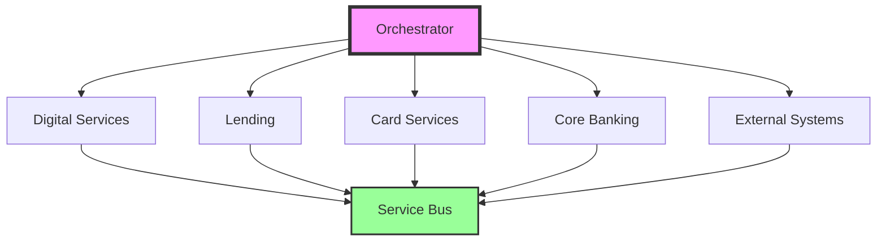
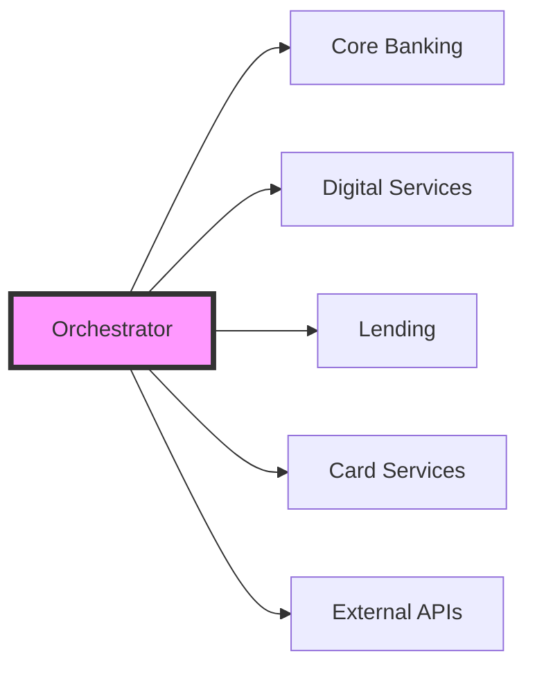

The Orchestrator module serves as the central nervous system of Woodcore's banking platform, managing and coordinating complex workflows across different modules and systems. It ensures seamless integration and communication between various banking services while maintaining high performance and reliability.

> 💡 **System Orchestration**
> 
> The Orchestrator module is the backbone of Woodcore's microservices architecture, enabling efficient service coordination and workflow management across the entire banking platform. It provides a robust service bus layer that allows for flexible integration and extension of banking capabilities.

## Core Capabilities

| Capability | Description | Features |
|------------|-------------|----------|
| **Workflow Management** | Process orchestration and coordination | • Process orchestration • Service coordination • Task scheduling • Workflow monitoring • Error handling |
| **Integration Management** | Service integration and communication | • Service discovery • API management • Protocol translation • Message routing • Load balancing |
| **Event Management** | Event-driven architecture support | • Event processing • Event routing • Event persistence • Event monitoring • Event recovery |
| **System Monitoring** | Comprehensive system oversight | • Performance monitoring • Health checks • Resource utilization • Alert management • Logging and tracing |

## Service Bus Architecture

> 🔄 **Service Bus Layer**
> 
> Woodcore's service bus layer provides a powerful foundation for building and extending banking capabilities:
> - Message-based communication between services
> - Event-driven architecture support
> - Protocol-agnostic service integration
> - Real-time data streaming capabilities
> - Asynchronous processing support
> - Service discovery and registration
> - Dynamic routing and load balancing
> - Message transformation and enrichment

## Key Features

| Feature Category | Description | Components |
|-----------------|-------------|------------|
| **Service Orchestration** | Microservices coordination | • Microservices coordination • Service discovery • Load balancing • Circuit breaking • Service mesh integration |
| **Workflow Management** | Process automation and control | • Process automation • Task scheduling • State management • Error recovery • Transaction management |
| **Integration Capabilities** | System integration features | • API gateway • Protocol translation • Message transformation • Service routing • Security management |
| **Monitoring and Analytics** | System oversight and analysis | • Performance metrics • System health • Resource utilization • Error tracking • Usage analytics |

## Integration Points

> ℹ️ **System Integration**
> 
> The Orchestrator module provides a unified interface for all system integrations, ensuring consistent communication and data flow across the entire banking platform. The service bus layer enables:
> - Seamless integration with legacy systems
> - Real-time data synchronization
> - Bi-directional communication
> - Protocol translation
> - Message transformation
> - Service discovery
> - Load balancing
> - Circuit breaking

## Technology Extension Capabilities

| Extension Type | Description | Benefits |
|----------------|-------------|----------|
| **Custom Services** | Build and deploy new services | • Rapid service development • Standardized integration • Automated deployment • Service monitoring • Performance optimization |
| **API Extensions** | Extend existing APIs | • API versioning • Custom endpoints • Enhanced security • Rate limiting • Documentation |
| **Event Handlers** | Custom event processing | • Event subscription • Custom processing • Event transformation • Error handling • Monitoring |

> 💡 **Technology Advancement**
> 
> Woodcore's service bus layer enables organizations to:
> - Build custom services on top of core banking
> - Integrate with emerging technologies
> - Implement new payment methods
> - Add blockchain capabilities
> - Deploy AI/ML services
> - Create custom workflows
> - Extend existing functionality
> - Implement new business rules

## Security and Performance

| Aspect | Features | Capabilities |
|--------|----------|--------------|
| **Security Features** | System protection | • API security • Authentication • Authorization • Encryption • Audit logging |
| **Performance Features** | System optimization | • Caching • Load balancing • Rate limiting • Circuit breaking • Resource optimization |

> ⚠️ **Important Note**
> 
> Ensure proper configuration of service endpoints and security policies before deploying the Orchestrator in production. This includes:
> - Service endpoint configuration
> - Security policy implementation
> - Performance tuning
> - Monitoring setup
> - Backup and recovery procedures
